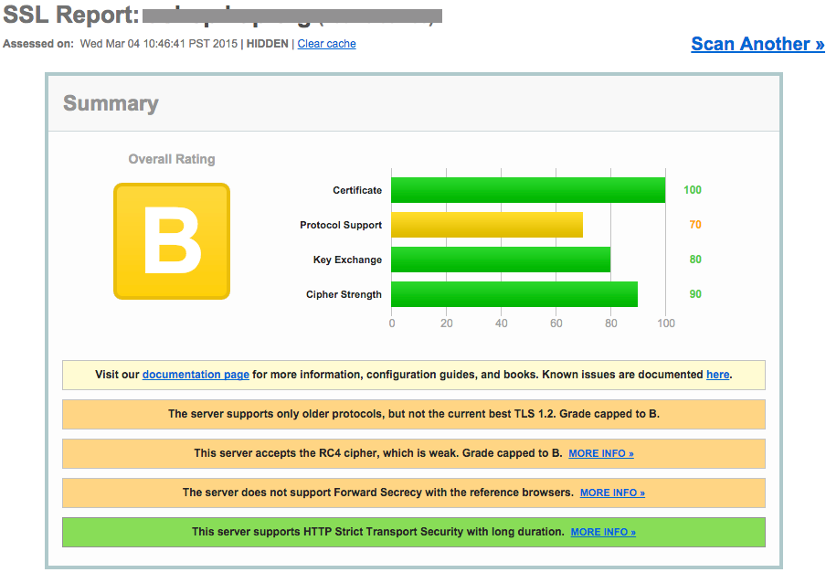
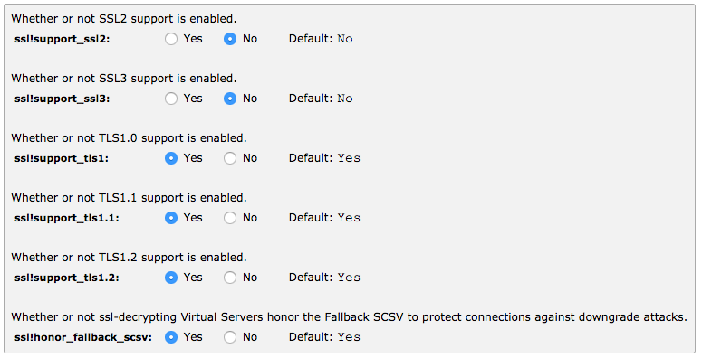
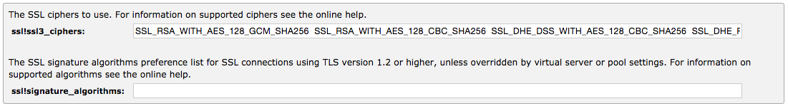
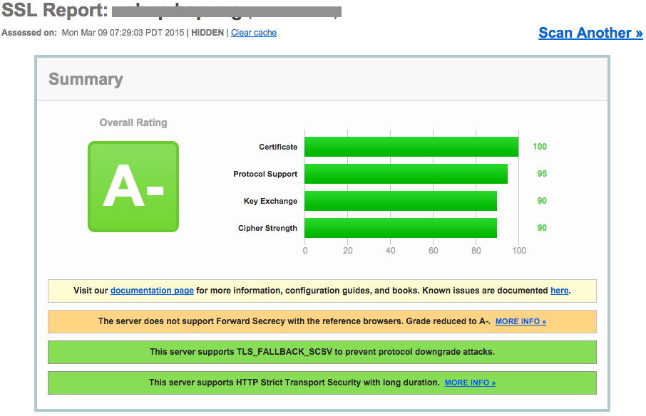
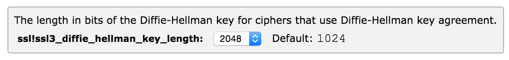
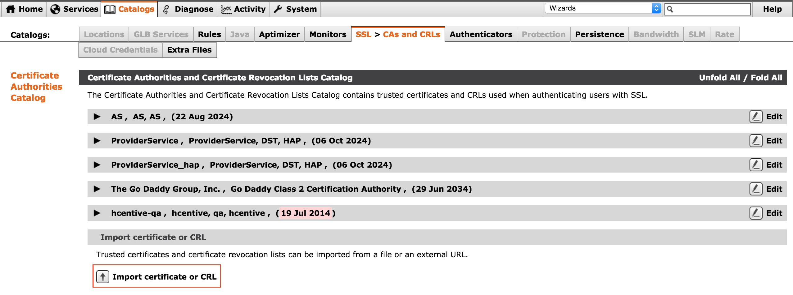
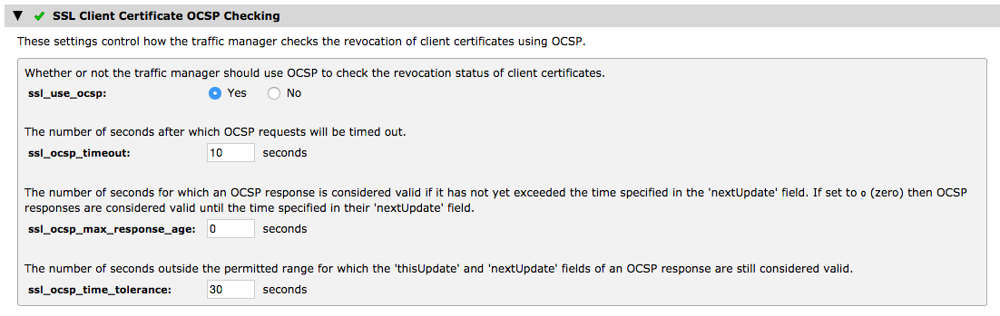
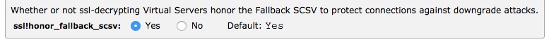

# SSL configuration for web applications
This document describes recommended SSL configuration for web applications. It lists the configuration options to set in Zeus load balancer and Apache web server. The configuration is tested with [Qualys' SSL Labs test](https://www.ssllabs.com/ssltest/). The goal for each website is to get an A+ rating.

`
NOTE: It is recommended to take a backup of any existing configuration before making changes.
`

Run the SSL Labs test on an existing website to find out which configurations to fix.



## Protocols
Disable older protocols like `SSLv2` and `SSLv3`. Supported protocols should be `TLSv1`, `TLSv1.1` and `TLSv1.2`. Disabling `SSLv3` will mean that older browsers like IE6 will get certificate errors. As none of hCentive's products support IE6 anymore, this should not be a problem.

With Apache, this can be achieved by adding the following line to the virtual host configuration
```
SSLProtocol             all -SSLv2 -SSLv3 -TLSv1
```
Zeus/Stingray load balancer currently does not support `TLSv1.2`. To switch off `SSLv2` and `SSLv3`, and enable `TLSv1` and `TLSv1.1`, go to `Global Settings` sub-tab under the `System` tab.

In the `SSL Configuration` section, disable `SSLv2` and `SSLv3`, and enable `TLSv1` and `TLSv1.1`.



## Ciphers
256-bit ciphers and hashes are recommended over 128-bit ciphers. Also, supporting [ECDHE](https://en.wikipedia.org/wiki/Elliptic_curve_Diffie–Hellman) is recommended to give us [forward secrecy](http://en.wikipedia.org/wiki/Forward_secrecy). Also, RC4 ciphers should be disabled as they are considered too weak.

The following configuration is [recommended](https://wiki.mozilla.org/Security/Server_Side_TLS#Recommended_configurations) for Apache
```
SSLCipherSuite          ECDHE-RSA-AES128-GCM-SHA256:ECDHE-ECDSA-AES128-GCM-SHA256:ECDHE-RSA-AES256-GCM-SHA384:ECDHE-ECDSA-AES256-GCM-SHA384:DHE-RSA-AES128-GCM-SHA256:DHE-DSS-AES128-GCM-SHA256:kEDH+AESGCM:ECDHE-RSA-AES128-SHA256:ECDHE-ECDSA-AES128-SHA256:ECDHE-RSA-AES128-SHA:ECDHE-ECDSA-AES128-SHA:ECDHE-RSA-AES256-SHA384:ECDHE-ECDSA-AES256-SHA384:ECDHE-RSA-AES256-SHA:ECDHE-ECDSA-AES256-SHA:DHE-RSA-AES128-SHA256:DHE-RSA-AES128-SHA:DHE-DSS-AES128-SHA256:DHE-RSA-AES256-SHA256:DHE-DSS-AES256-SHA:DHE-RSA-AES256-SHA:!aNULL:!eNULL:!EXPORT:!DES:!RC4:!3DES:!MD5:!PSK
```
Zeus supports specifying ciphers using the `ssl!ssl3_ciphers` configuration in the `SSL Configuration` section under `Global Settings -> System`. Recommended ciphers, with their order, are
* `SSL_RSA_WITH_AES_128_GCM_SHA256`
* `SSL_RSA_WITH_AES_128_CBC_SHA256`
* `SSL_DHE_DSS_WITH_AES_128_CBC_SHA256`
* `SSL_DHE_RSA_WITH_AES_128_GCM_SHA256`
* `SSL_DHE_RSA_WITH_AES_128_CBC_SHA256`
* `SSL_RSA_WITH_AES_128_CBC_SHA`
* `SSL_DHE_DSS_WITH_AES_128_CBC_SHA`
* `SSL_DHE_RSA_WITH_AES_128_CBC_SHA`
* `SSL_RSA_WITH_AES_256_GCM_SHA384`
* `SSL_RSA_WITH_AES_256_CBC_SHA256`
* `SSL_DHE_DSS_WITH_AES_256_CBC_SHA256`  
* `SSL_DHE_RSA_WITH_AES_256_GCM_SHA384`
* `SSL_DHE_RSA_WITH_AES_256_CBC_SHA256`
* `SSL_RSA_WITH_AES_256_CBC_SHA`
* `SSL_DHE_DSS_WITH_AES_256_CBC_SHA`
* `SSL_DHE_RSA_WITH_AES_256_CBC_SHA`



`NOTE: Version 9.9 of Zeus does not support ECDHE. As a result, forward secrecy is not available on web applications that terminate SSL on it.`
### Cipher suites order
Ciphers should be ordered so that the most preferred ciphers are specified first in the list. When the browsers sends a list of supported ciphers, the server will select the first one that matches the ordered list.

In the Apache configuration, set the `SSLHonorCipherOrder` directive to `on`
```
SSLHonorCipherOrder     on
```
Running the test again will show that the weak ciphers warning is not displayed anymore. Also, the warning for unsupported TLS 1.2 is gone as well. The grade has improved to A-. The grade will be capped at A- until Zeus implements support for ECDHE ciphers.



### DHE key length
Set the length of the ephemeral Diffie-Hellman (DHE) key to be greater than 1024. With Zeus, this can simply be done by updating the `ssl!ssl3_diffie_hellman_key_length` setting in `SSL Configuration` under `Global Settings`


Apache 2.4.7 selects the higher cipher strength automatically. For lower versions, a special parameters file should be created with the key length of 2048 using `openssl`, and specified in the configuration file with the `SSLOpenSSLConfCmd` directive.
```
$ openssl dhparam -out dhparams.pem 2048
```
Add directive to apache configuration
```
SSLOpenSSLConfCmd DHParameters dhparams.pem
```

`NOTE:` Java clients, written in JDK 7 or lower, that access web applications/services set up to support only 2048-bit DHE ciphers will raise java.security.InvalidAlgorithmParameterException. JDK 7 does not support ciphers longer than 1024 due to a performance bottleneck in prime generation. This is documented in ticket [JDK-704460](http://bugs.java.com/bugdatabase/view_bug.do?bug_id=7044060). The patch to fix this issue is linked to in the ticket as well. A workaround is to use another Java Cryptography Extensions (JCE) provider like [Bouncy Castle](http://docs.oracle.com/cd/E19830-01/819-4712/ablsc/index.html) instead of the default Oracle JCE implementation.

## Intermediate Certificates
Install root and intermediate certificates from the certificate authority (CA). This will enable the browser validate the certificate chain. Download the certificate bundle from the CA's repository.
```
wget -O https://certs.godaddy.com/repository/gd_bundle-g2.crt | tee -a ca-certs.pem > /dev/null
```
In Apache, add the `SSLCACertificateFile` directive that points to the CA bundle
```
SSLCACertificateFile    /etc/ssl/ca-certs.pem
```
In Zeus, import the certificate bundle `CA and CRLs` section under the `SSL` tab of the `Catalogs` section.



## OCSP Stapling or CRLs
When making a request to the server, the client should verify the validity of the SSL certificate using either a Certificate Revocation List (CRL), or an Online Certificate Status Protocol (OCSP) record.

In most modern web servers, the server itself can check the revocation status of the certificate at regular intervals. The web server will contact the OCSP server to retrieve a response signed by the CA. This response is _stapled_ to the certificate before it is sent to the client.

OCSP stapling is supported in Apache versions greater than 2.3.3. To enable it, download the certificate authority's (CA) root and intermediate certificate bundle.
```
cd /etc/ssl
wget -O https://certs.godaddy.com/repository/gd_bundle-g2.crt | tee -a ca-certs.pem > /dev/null
```
Add the cache location above the `<VirtualHost>...</VirtualHost>` section
```
SSLStaplingCache shmcb:/tmp/stapling_cache(128000)
```
In the `<VirtualHost>` section add the following directives
```
SSLCACertificateFile    /etc/ssl/ca-certs.pem
SSLUseStapling          on
```
With Zeus, enable `ssl_use_ocsp` in the `SSL Decryption` section of the virtual server configuration


## HSTS
[HTTP Strict Transport Security](https://en.wikipedia.org/wiki/HTTP_Strict_Transport_Security) tells the browser to communicate with the website over SSL only. It is implemented by adding the `Strict-Transport-Security` response header. In Apache, enable `mod_headers` and add a directive to always set the HSTS header with a `max-age` value of `31536000` and to include sub-domains.
```
sudo a2enmod headers
```
```
<VirtualHost x.x.x.x:443>
  Header always set Strict-Transport-Security "max-age=31536000; includeSubDomains"
</VirtualHost>
```
When you inspect headers for requests to the website, you should see the following in the list of header values
```
curl -I https://ushop.hap.org
...
Strict-Transport-Security: max-age=31536000; includeSubDomains
...
```
## TLS_FALLBACK_SCSV
[TLS Fallback Signaling Cipher Suite Value](https://tools.ietf.org/html/draft-ietf-tls-downgrade-scsv-00) prevents TLS clients, like browsers, from downgrading the SSL/TLS version for a connection. During a TLS handshake, a browser can indicate to the server that they tried connecting with a higher version of TLS but the attempt failed. The browser then attempts a connection with a downgraded TLS/SSL version as a fallback mechanism. This protocol negotiation method was introduced to support outdated/older browser versions, but it can be exploited by attackers to [initiate a denial of service attack](https://www.openssl.org/news/secadv_20141015.txt).

To prevent this on servers running Apache, upgrade `openssl` to version `1.0.1j` or higher.

On Zeus, set the `ssl!honor_fallback_scsv` global SSL setting value to `Yes`.



# References
* [How does SSL/TLS work?](http://security.stackexchange.com/questions/20803/how-does-ssl-tls-work)
* [SSL/TLS Deployment Best Practices](https://www.ssllabs.com/projects/best-practices/)
* [SSL Server Test](https://www.ssllabs.com/ssltest/index.html)
* [SSL/TLS Client Capabilities Test](https://www.ssllabs.com/ssltest/viewMyClient.html)
