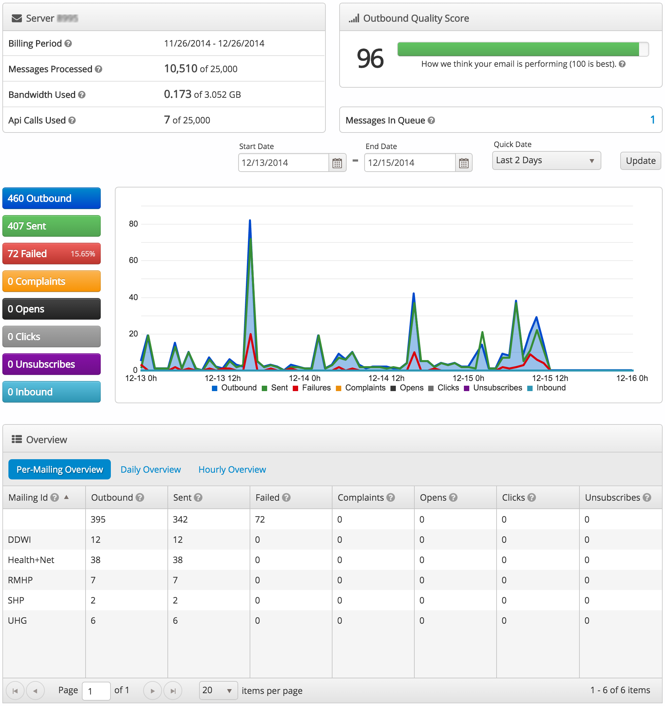
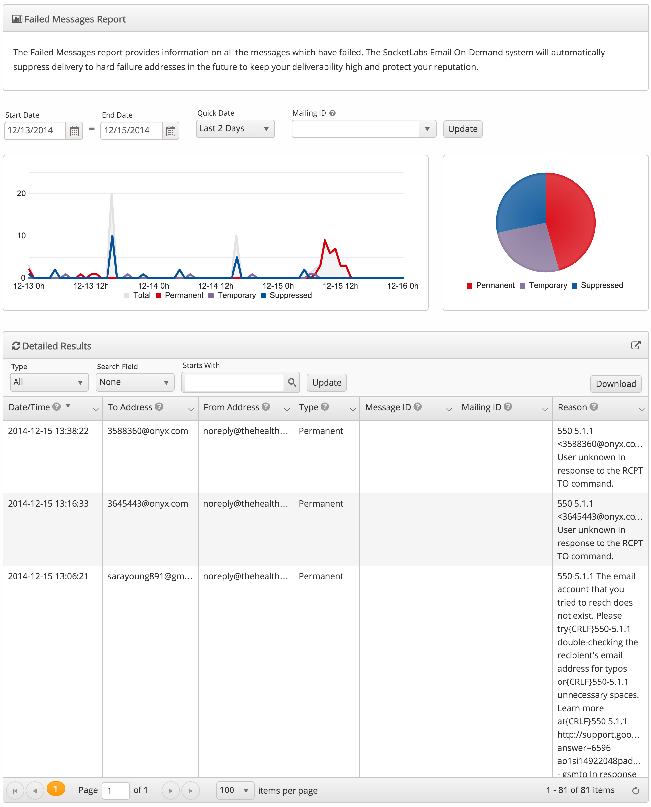
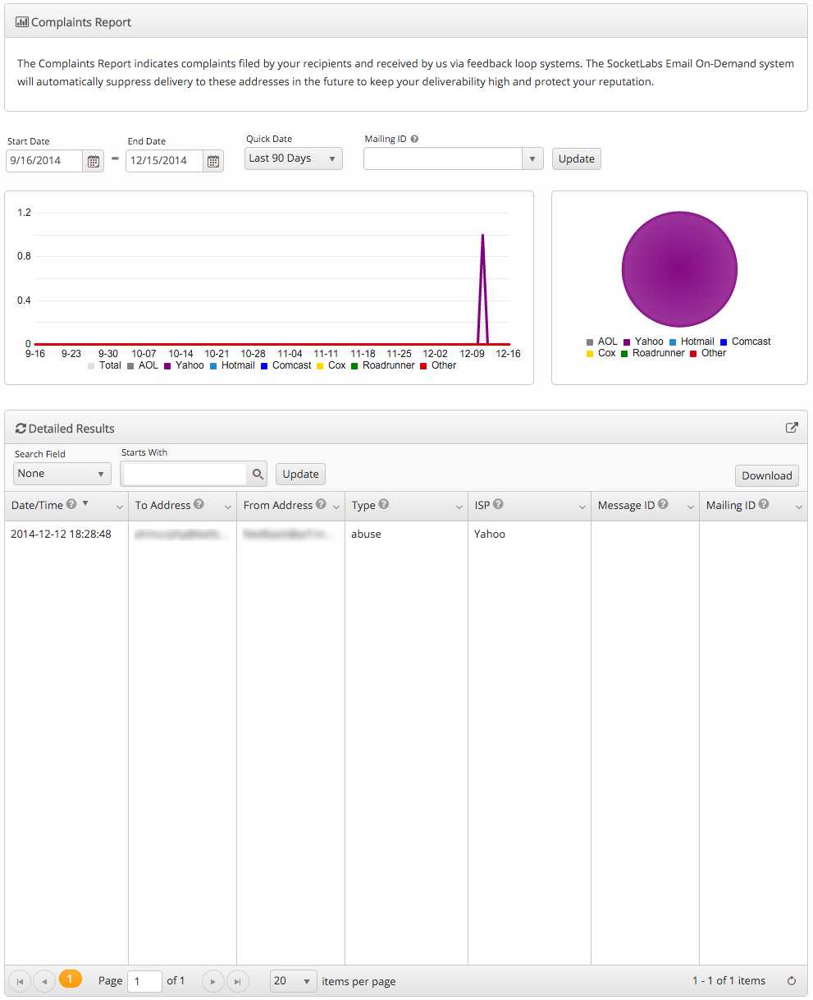
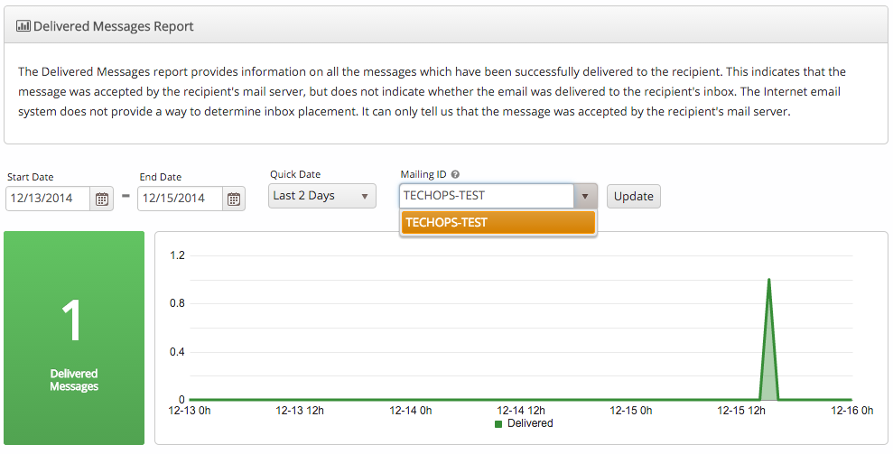
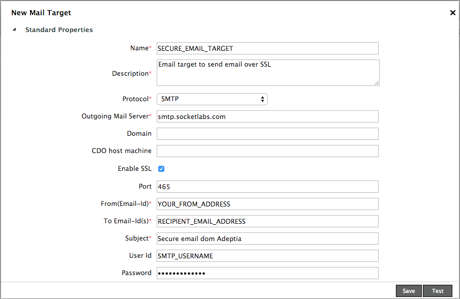

Sending Email Through SocketLabs
================================
This document describes best practices to follow when sending email via [SocketLabs](http://www.socketlabs.com). It also describes some of the best practices to be followed to ensure a high probability of email delivery. It is divided into the following sections
* [Best Practices](#best-practices)
* [SocketLabs Features](#features)
* [Getting Started](#getting-started)
* [Setup](#setup)

hCentive uses [SocketLabs](http://www.socketlabs.com/features/) as it's hosted SMTP service provider. SocketLabs provides a number of features to ensure reliable delivery of email. It also has advanced reporting capabilities to help improve email performance.

<a name="best-practices"></a>Best Practices
-------------------------------------------
Email is relatively old technology that was not designed to handle the abuse spammers have put it through. There is an ecosystem of services and protocols to keep spam email away from users' inbox.

To enable delivery of valid email, some best practices are suggested to be followed. This section will limit the best practices relevant to sending email from code.

### <a name="can-spam"></a>CAN-SPAN Act Requirements
Read the [CAN-SPAM Act](http://business.ftc.gov/documents/bus61-can-spam-act-compliance-guide-business) and make sure the email adheres to the requirements.

### <a name="from-address"></a>FROM Address Requirements
##### Valid address
Most email providers now attempt to confirm the sender of an email by verifying that the provided FROM address actually exists.

For example, if a batch process sends an email to a broker's client's email address (say "broker1-client@client-isp.com") using the broker's email address (say "broker1@hcentive.com") registered with an application, the client's mail server may contact the broker's mail server (at "hcentive.com") to confirm that "broker1" is a valid user. If the return address proves to be incorrect, the email may not be accepted by "client-isp.com" servers.

If sender verification fails, the bounced email will indicate that verification attempt failed (usually with a 550 error code). The only solution is to use a real email address.

##### Do Not Use info@ address
Most spam originates from `info@` addresses as it is a default email address created by many domain registrars. Spammers utilize it in  from addresses heavily. There is a higher probability of an email from an `info@` mailbox being marked as spam

##### Use Friendly/Personal Name
The from address consists of two parts - the actual addess and the friendly or personal name. For example, "hCentive Support &lt;support@hcentive.com&gt;". It is recommended to use a friendly name with the email address to improve deliverability.

Most APIs provide a way to set the friendly name. For example, using the JavaMail API this can be done with the [InternetAddress class's constructor](https://javamail.java.net/nonav/docs/api/javax/mail/internet/InternetAddress.html#InternetAddress(java.lang.String, java.lang.String) like this -
``` java
InternetAddress from = new InternetAddress("support@hcentive.com", "hCentive Support");
```

### Use MailingID and MessageID
As described in the [Setup](#setup) section below, it is essential to set the MailingID to be able to generate reports specific to a project and environment. A MailingID is assigned to a project/product and environment combination.

MessageID is a unique message identifier that can be set as a custom SMTP header in the message. The MessageID can be used to query for specific messages using the [Notification API](http://www.socketlabs.com/api-reference/notification-api/). The [Setup](#setup) section below describes how to set the custom header.

### Use TLS/SSL
Always send email over SSL. SocketLabs allows email injection over SSL via port 465.

### Test Sent Emails
Test sent emails by sending emails from the application to a GMail address you own. Use the "Show original" menu to view the raw content of the email. Email headers contain results of DKIM and Reverse PTR verification.
```
Received-SPF: pass
Authentication-Results: ... spf=pass ... dkim=pass
```

[Port25.com](http://www.port25.com/) can also be used to test email authentication. Send an email to `check-auth@verifier.port25.com`, and they will send an extensive diagnostic report to the `from:` address from which the test email was sent.
```
SPF check:          pass
DomainKeys check:   neutral
DKIM check:         pass
Sender-ID check:    pass
SpamAssassin check: ham
```

<a name="features"></a>SocketLabs Features
------------------------------------------
SocketLabs has a number of features that ensure and improve delivery and analytics.
### <a name="deliverability"></a>Deliverability
The following features help increase email deliverability by reducing complaint rates.
##### Email Authentication
* [Reverse PTR record](http://aplawrence.com/Blog/B961.html)
* [DomainKeys Identified Mail](https://support.socketlabs.com/index.php/Knowledgebase/Article/View/112/0/socketlabs-email-on-demand-and-dkim-authentication)
* [SPF and SenderID records](https://support.socketlabs.com/index.php/Knowledgebase/index.php/Knowledgebase/Article/View/98)

##### Suppression List
[Suppression list](https://support.socketlabs.com/index.php/Knowledgebase/Article/View/92) helps improve the reputation of our domain. Dynamic block rules block email to any know invalid email address or any email address from which a complaint is received. Any time a 5XX level error is received from the receiving mail server, the address is automatically address to the suppression list. SocketLabs will not send emails to addresses in the suppression list until the address is removed from the list.

##### Bounce and Feedback Loop Test
An auto-responder is provided by SocketLabs to test bounce and feedback loop processing
* fbl-test@service.socketlabs.com - auto responds to the From address with a feedback report in ARF format.
* bounce-test@service.socketlabs.com - auto responds to the Return-Path with a bounce message.

Developers are encouraged to use this feature.

##### Warm up period
The warm up period is the initial amount of time, after setting up the account or server, during which SocketLabs throttles rate of sending messages. The rate limiting occurs at SocketLabs and does not affect the rate at which applications send messages from our applications. The limits vary by receiving email servers.

This rate limiting helps train the receiving emails servers to understand that our messages are legitimate. For example, Gmail's filters look at hundreds of data points before placing a message in the inbox.

### <a name="security"></a>Security
##### SSL/TLS
SocketLabs supports [email encryption](https://support.socketlabs.com/index.php/Knowledgebase/Article/View/141) in transit via a secure connection over SSL/TLS, or with the SMTP protocol command STARTTLS.

hCentive's applications establish an SMTP connection over port 465 to inject email securely into SocketLab's inbound SMTP gateway.

##### Whitelist
SocketLabs allows users to provide specific email address or domains that are permitted in the MAIL FROM SMTP command during the mail relay process. Emails from any addresses not listed in the whitelist will be rejected at the SMTP protocol level.

### <a name="analytics"></a>Analytics
SocketLabs provides detailed reporting and analytics at the account and server level. Multiple SMTP servers can be provisioned in one account.

##### Dashboard
The server dashboard displays a summary of all outbound messages sent, failed, complaints, opens and clicks.



##### Failed Messages
Automatic bounce processing uses [VERP (Variable Envelope Return Path)](http://en.wikipedia.org/wiki/Variable_envelope_return_path) to ensure bounces automatically flow directly back to the server. The encoding process embeds message identifiers into the return path so that any message ID tagged in the message remains there, even through the bounce. This enables the server to immediately analyze the bounced message. The results can be studied in the reports and logs.



More information on how SocketLabs handles bounces and non-delivery reports can be found [here](https://support.socketlabs.com/index.php/Knowledgebase/Article/View/96/0/how-email-on-demand-servers-handle-bounces-and-non-delivery-reports-ndrs)

##### Complaints
The complaints reports shows the number of feedback loop complaints, or messages marked as spam, received from the message recipients.



<a name="getting-started"></a>Getting Started
---------------------------------------------
To use SocketLabs to send email from your application, create a JiRA issue in the [INFRA](https://hcentive.jira.com/browse/INFRA) project to request your credentials.
TechOps will share details of the SocketLabs SMTP server, your username and password. They will also assign a **Mailing ID** specific for your project. This Mailing ID is to be used as the value of the `X-xsMailingId` [custom header]() in your outbound email messages. It usually is a combination of the project/product and the environment.

An example of this information is
```
SMTP Server:    smtp.socketlabs.com
SMTP Port:      465
SMTP Username:  serverXXXXX
SMTP Password:  xxxxxxxxxxx
X-xsMailingId:  TECHOPS-TEST
```

In the sample above, the value of the `X-xsMailingId` header in the message helps filter email messages sent by the Techops test environment. This custom header is _necessary_ for generating delivery reports for your project. This header value is also encoded in the [return path](http://en.wikipedia.org/wiki/Variable_envelope_return_path) for managing email bounces effectively.



<a name="setup"></a>Setup
-------------------------
Some examples of setting up SocketLabs SMTP as the [MTA](http://en.wikipedia.org/wiki/Message_transfer_agent) to send email follow.
##### JavaMail API
[JavaMail API](https://javamail.java.net/nonav/docs/api/) supports sending email over SSL using the `mail.smtp.socketFactory.class` and `mail.smtp.socketFactory.port` properties.

```java
Properties props = new Properties();
props.put("mail.smtp.socketFactory.class", "javax.net.ssl.SSLSocketFactory");
props.put("mail.smtp.socketFactory.port", "465");
```

The [MimeMessage](https://javamail.java.net/nonav/docs/api/javax/mail/internet/MimeMessage.html) supports setting custom SMTP headers in a message.
```java
Message message = new MimeMessage(session);
message.setHeader("X-xsMailingId", "TECHOPS-TEST");
```
An example of using the JavaMail API to send email via SocketLabs is available [here](code/SendMailSocketLabs.java)
##### Adeptia
Adeptia supports sending email over SSL. When configuring a `Mail` target under `Services`, enable SSL and set the port to `465` to send email over SSL.



Adeptia does not support adding custom SMTP headers to an email message. It is recommended to use a unique from email address for a customer when sending email from Adeptia.

##### JBoss Fuse
TBD

References
----------
* [SMTP RFC](https://www.ietf.org/rfc/rfc2821.txt)
* [SocketLabs Best Practices blog](http://www.socketlabs.com/blog/category/best-practices/)
* [SocketLabs Deliverability blog](http://www.socketlabs.com/blog/category/deliverability/)
* [Having Trouble Sending Mail?](http://nemesis.lonestar.org/site/mail_trouble.html)
* [So You'd Like to Send Some Email (Through Code)](So You'd Like to Send Some Email (Through Code))
